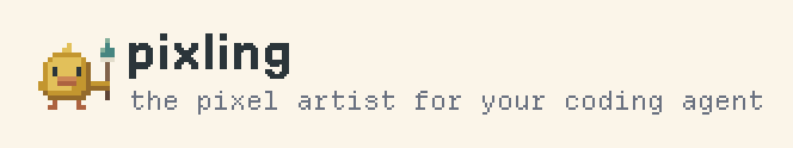
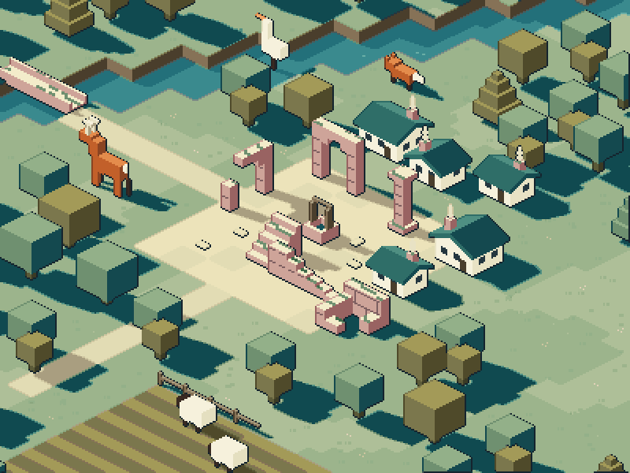
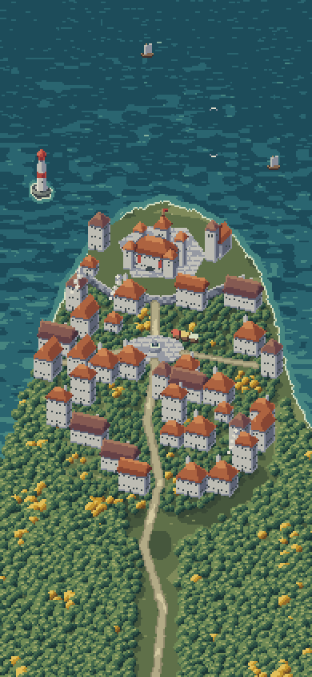
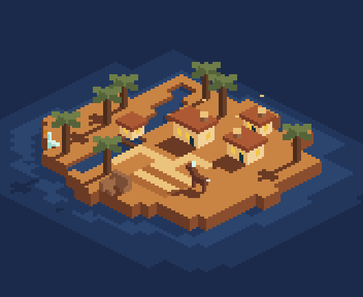

<p align="center">
  <picture>
    <source media="(prefers-color-scheme: dark)" srcset="docs/brand/pixling-banner-dark.png">
    
  </picture>
</p>

<p align="center">
  <b>The pixel artist for your coding agent.</b><br>
  Pipelines, styles and taste for making game sprites with code. Works with Claude Code, Codex and Cursor.
</p>

<p align="center">
  
</p>

Coding agents can write your game, but they can't draw. pixling gives them pipelines that render real pixel art from
code, curated styles that ship with how they were made, and the taste rules behind them. The agent writes a spec,
builds it, looks at the result and iterates, the way it does with a failing test.

## Install
```bash
uv tool install pixling        # or: pipx install pixling   ·   or: npx pixling
pixling agent install .        # in your game repo: adds the skill and an AGENTS.md block
```
Then ask your agent:

> make a harbour town in the vista style, with lamps that light up at dusk, into assets/maps

## Quickstart
```bash
pixling new house_5 inn          # start a spec from an example -> specs/inn.json
pixling build specs/inn.json     # -> out/inn/: sprite sheets, GIFs, JSON
pixling review out/inn           # a zoomed sheet to judge by eye
pixling                          # every command; each takes -h, the ones agents parse take --json
```

## Pipelines
| Pipeline | Makes |
|---|---|
| **spec** | 8-direction sprites, props and buildings from a JSON spec, byte-for-byte reproducible |
| **iso** | exact 2:1 isometric scenes and animal sheets from a Python kit |
| **board** | zoomed-out tactics boards: square 3/4 tilesets and tiny hand-placed pieces (8-16 px units and creatures) |
| **map** | living maps: building states, hour-of-day lighting, a meaning layer, engine layers |
| **fx** | VFX sheets posterised to a style's palette |
| **video** | sprites cut from AI video into 8-direction sheets (via [Scenario](https://scenario.com), optional) |
| **painted** | painterly, non-pixel sprites and scenes rendered in Blender |
| **style** | a new art style from scratch: refs, hand, kit, review |

`pixling pipelines NAME` shows each one's steps, code and lessons. Output is engine-ready: sheets, GIFs, JSON metadata,
`.aseprite` files, and for maps collision, depth and light layers.

## Styles
Four launch styles, each with its own hand (camera, shading, line, shadows) and kit. `pixling styles NAME --how`
shows how each was made.

| **Vista** | **Crisp Tactics** | **Flat Minimal** | **8-bit Board** |
|---|---|---|---|
|  |  |  |  |
| painted aerial towns and world maps | exact isometric, flat faces, soft line | exact isometric, two hues, long flat shadows | square top-down tiles, tiny outlined pieces |

Everything above is rendered by the engine. The 8-bit Board's pieces are pixel grids in their spec (below ~20 px
the artist places pixels); their outline, animation, facings and variants are generated.

## Docs
- [docs/PIPELINES.md](docs/PIPELINES.md): every pipeline, step by step
- [docs/ARTIST.md](docs/ARTIST.md): the spec format and design rules
- [docs/STYLES.md](docs/STYLES.md): the styles and how a new one is made
- [docs/ENVIRONMENTS.md](docs/ENVIRONMENTS.md): living maps

The same docs are built into the CLI: `pixling guide`.

## Develop
```bash
git clone https://github.com/trinity-works/pixling && cd pixling
pip install -e .
python3 -m unittest discover -s tests     # the video tests need ffmpeg
```
Rules for agents working on the engine are in [AGENTS.md](AGENTS.md). Issues and pull requests are welcome.

## License
[MIT](LICENSE). Fonts in `docs/brand/fonts` and `site/fonts` are under the SIL Open Font License: wordmark in
[Jersey 15](https://github.com/scfried/soft-type-jersey) by the Soft Type Project, tagline in
[Departure Mono](https://departuremono.com) by Helena Zhang, site in Geist.
