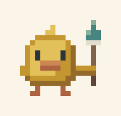

# pixling brand

**pixling**: the pixel artist for your coding agent. Always lower case, one word. The engine underneath is still
Pixel Perfect (`pp/`); pixling is the product and the command.



## The mascot
Pixling is a tiny chick holding a paintbrush: 18 x 15 pixels placed by hand, like Claude's Clawd. It follows the
vista style: flat, calm value masses, light from the upper left (shade on the right and below), no black outline
(each edge is the colour's own darker shade), and only vista colours: leaf-gold down, terracotta bill and feet,
slate eyes, a teal-loaded brush with a cream ferrule. The grid lives in `tools/brand_mark.py`, with a brushless
version for 16 px favicons and a hand-timed idle. Its actions are offset, never switched on together: a
two-frame blink on its own beat, then a breath where the body dips a pixel, the brush follows a frame late, the
chick hugs the brush in at the bottom of the squash, and the brush catches up a frame after the body rises.

The engine draws a bigger duckling painter too (`specs/sunmeadow/pixling.json`, the walk and paint GIFs), to show
what the forge makes.

## Files (all generated by `python3 tools/brand.py`)
| File | Use |
|---|---|
| `pixling-banner(.svg/.png)`, `-dark` | README header, with the tagline |
| `pixling-logo(.svg/.png)`, `-dark` | mascot + wordmark, transparent |
| `pixling-mark(.svg/.png)`, `pixling-mark-plain.svg` | the mascot alone (avatar, sticker) / without the brush |
| `pixling-mark-idle.gif`, `pixling-mark-1x.png` | the mascot's idle / 1x (drawn by the CLI in the terminal) |
| `pixling-app-icon.png`, `favicon-16/32/64.png` | square icon on paper / favicons (exact pixels) |
| `pixling-social.png` | GitHub social preview, 1280 x 640 |
| `pixling-forge-duckling.png`, `pixling-sprite.png` | the engine-demo duckling (8x / 1x) |
| `pixling-walk.gif`, `pixling-paint.gif`, `pixling-idle.gif` | the engine-demo duckling animated |

Scale only by whole numbers with nearest-neighbour sampling, or use the SVGs (`shape-rendering: crispEdges`).
Never smooth, rotate or skew the mascot.

## ASCII
For logs, plain terminals and docs (`pp/brand.py`: `ASCII_MARK`):
```
      ,       ^
    .-'-.    /#\
   | o o |   '='
   | <=> |----|
    '---'     |
    "   "
```

## Type
- **Wordmark: Jersey 15** by the Soft Type Project (SIL OFL 1.1, `fonts/Jersey15-Regular.ttf`). A friendly, bold
  pixel face: set it at multiples of 27 px with antialiasing off and 1 px tracking, and every font pixel lands on a
  screen pixel. In the lockups the mascot is doubled (one mascot pixel = two font pixels), the word sits three
  mascot pixels after the brush and its ink box is centred on the mascot's height.
- **Mono: Departure Mono** by Helena Zhang (SIL OFL 1.1, `fonts/`). Tagline, code and terminal output. Set it in
  multiples of 11 px.

## Colour
All from `styles/vista.json` (`pp/brand.py`).

| Token | Hex | Role |
|---|---|---|
| ink | `#2b353a` | vista slate: text, wordmark, the mascot's eyes |
| paper | `#fbf5e9` | light background |
| night | `#1a2227` | dark background |
| down | `#e2c05a` / `#c3962f` / `#946a2a` | the brand colour (leaf gold: light, mid, shade) |
| bill | `#cc8654` / `#ad6340` | terracotta: bill, feet, small accents |
| paint | `#468580` / `#86b09c` | sea teal: the brush, links, calls to action |
| stone | `#6b7281` | secondary text (the tagline) |
